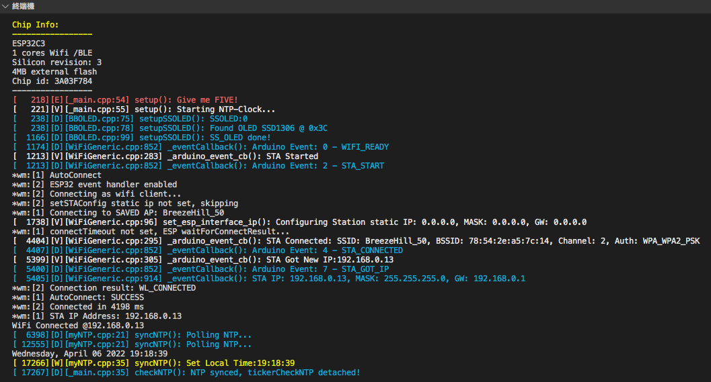
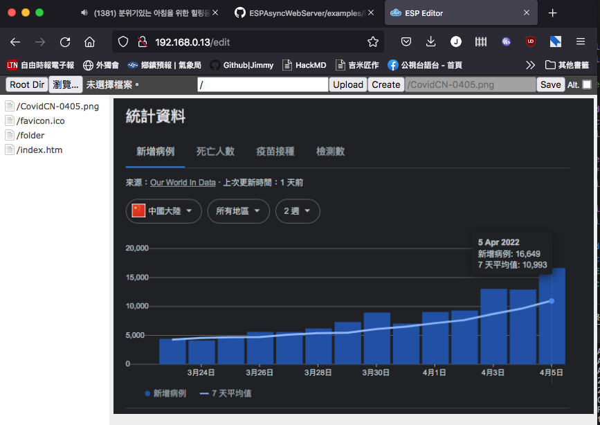
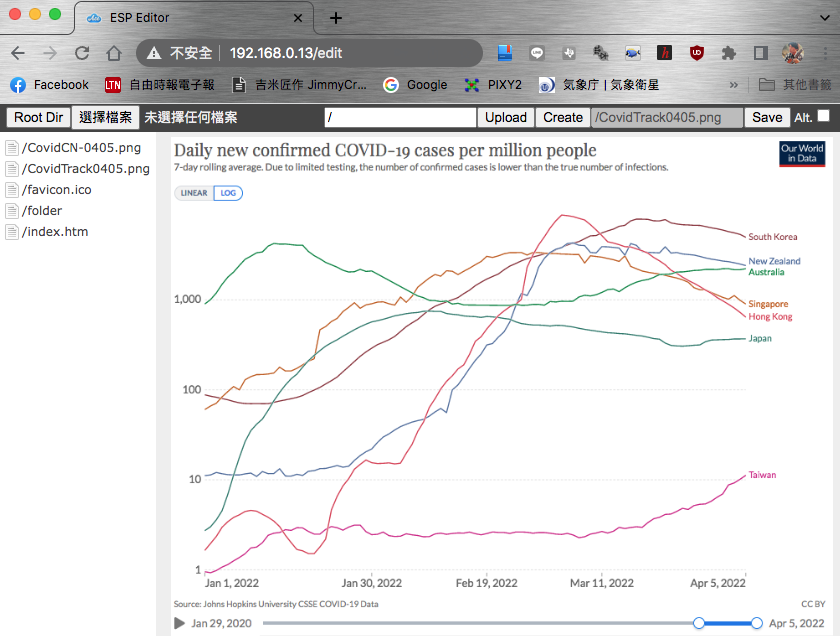
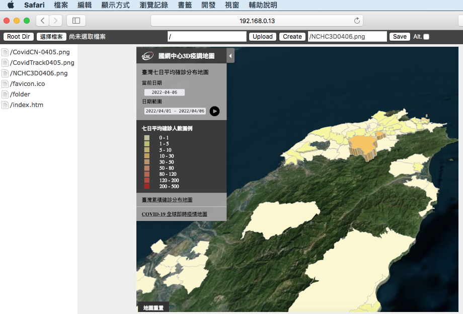

## PlatformIO Arduino Projects

ELK3 Javascript running init.js from LittleFS

 
          
A NTP Clock w/ bitbang OLED I2C.    [NTP Clock Project](https://github.com/jmysu/ESP32C3_Pico/tree/main/PlatformIO/ESP32C3_WiFi_NTP)  
  
 
### References
- [LittleFS](https://github.com/lorol/LITTLEFS) ESP32 LittleFS.  
- [ESP32 Async WiFiManagerLite](https://github.com/khoih-prog/ESPAsync_WiFiManager_Lite) WiFi Manager for ESP32 
- [Time](https://github.com/PaulStoffregen/Time) TimeLib  
- [BitBang I2C](https://github.com/bitbank2/BitBang_I2C) BitBang software I2C 

___
 

MyModbus [WiFi Modbus Project](https://github.com/jmysu/ESP32C3_Pico/tree/main/PlatformIO/ESP32C3_WiFi_Modbus) 

 
### References
- [eModbus](https://github.com/eModbus/eModbus) Arduino modbus library.
- [myModbusUtility](https://github.com/jmysu/RPI-ModbusClient) QT5 modbus utility 

___
 

Another CaptivePortal WiFiManager [WiFiMan](https://github.com/jmysu/ESP32C3_Pico/tree/main/PlatformIO/ESP32C3_WiFiMan) 

 
### References
- [ESP WiFiManager](https://github.com/tzapu/WiFiManager) A Fast & Easy WiFi Manager w/ Web CaptivePortal settings! 

___
 

Finally, put together the AsyncWebServer+LittleFS+FSBrowser+WebSocket w/ ESP32-C3 [WiFiMan FSBrowser](https://github.com/jmysu/ESP32C3_Pico/tree/main/PlatformIO/ESP32C3_WiFiManFSBrowser) 
Works with Firefox,Chrom,Safari! 
  
 
### References
- [ESP32 AsyncWebserver](https://github.com/DmytroKorniienko/ESPAsyncWebServer/tree/ESPAsyncWebServerMod) The ESP AsyncWebServer Mod for ESP32-C3+LittleFS  

___
 

