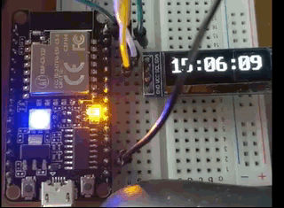
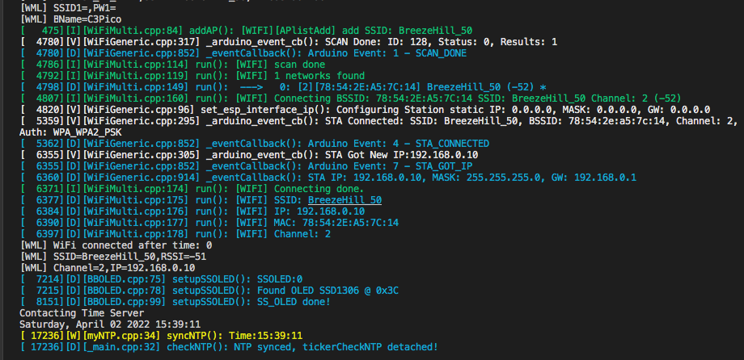
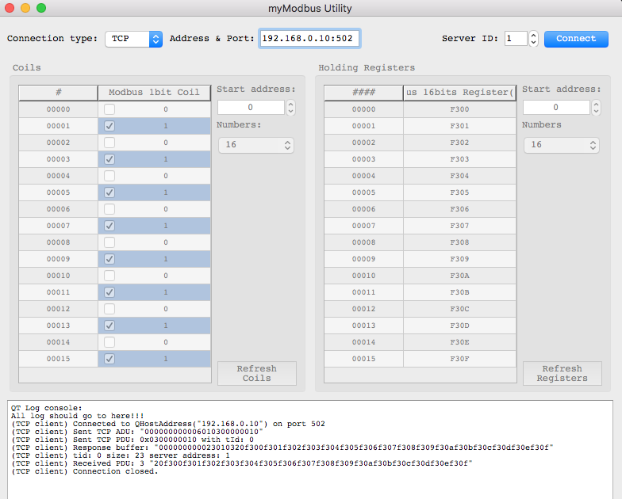

## PlatformIO Arduino Projects

A NTP Clock w/ bitbang OLED I2C.    [NTP Clock Project](https://github.com/jmysu/ESP32C3_Pico/tree/main/PlatformIO/ESP32C3_WiFi_NTP)  
  
 
### References
- [LittleFS](https://github.com/lorol/LITTLEFS) ESP32 LittleFS.  
- [ESP32 Async WiFiManagerLite](https://github.com/khoih-prog/ESPAsync_WiFiManager_Lite) WiFi Manager for ESP32 
- [Time](https://github.com/PaulStoffregen/Time) TimeLib  
- [BitBang I2C](https://github.com/bitbank2/BitBang_I2C) BitBang software I2C
 

MyModbus [WiFi Modbus Project](https://github.com/jmysu/ESP32C3_Pico/tree/main/PlatformIO/ESP32C3_WiFi_Modbus) 

 
### References
- [eModbus](https://github.com/eModbus/eModbus)Arduino modbus library.
- [myModbusUtility](https://github.com/jmysu/RPI-ModbusClient)QT5 modbus utility
