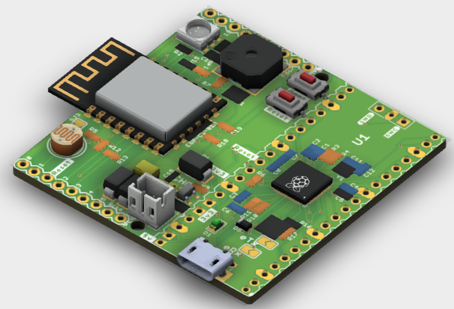
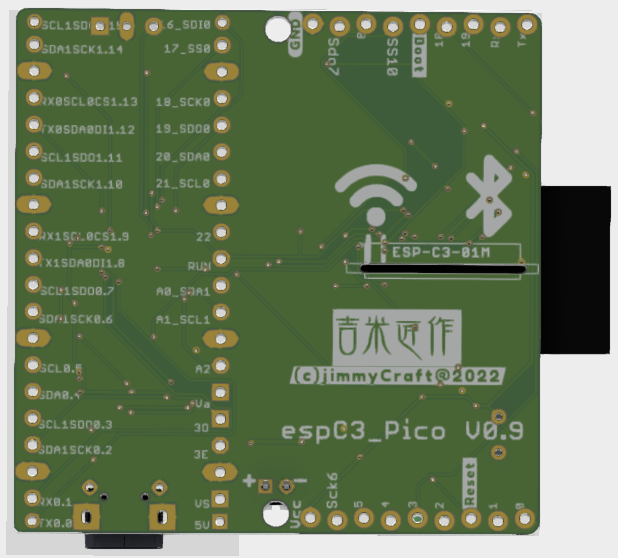

# ESP32C3_Pico
 
 ESP32-C3 platformIO startup, works with espC3_Pico(paper design WIP)  

 

 
 

Works platformIO project w/ ESP32-C3 & LittleFS

 

## References
- [AsyncTelegram2](https://github.com/cotestatnt/AsyncTelegram2)  A nice Telegram bot
