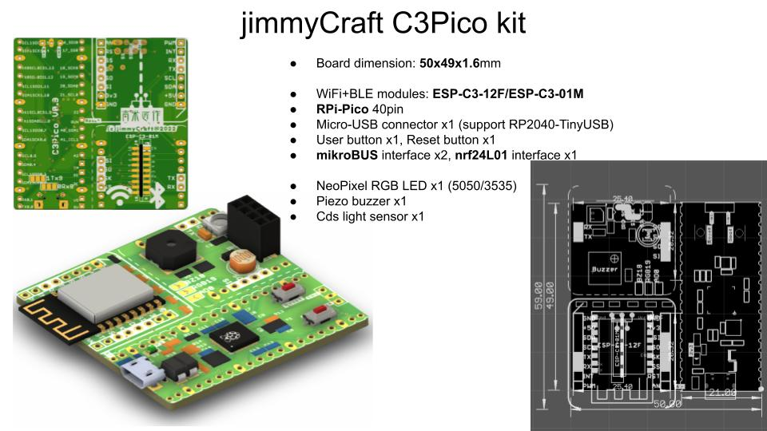

# ESP32C3_Pico
 
 ESP32-C3 platformIO startup, works with espC3_Pico(V0)  

 
 
 

Works platformIO project w/ ESP32-C3 & LittleFS 

  

Works w/ Telegram Bot 
 
 

## References
- [eagle2fritzing](https://github.com/squix78/eagle2fritzing-parent) Eagle brd to Fritzing parts convert 

### ESP32-C3  
 
- [Ai-Thinker ESP32-C3](https://docs.ai-thinker.com/en/esp32c3) Ai-Thinker ESP32-C3 modules.  
- [LittleFS](https://github.com/lorol/LITTLEFS) ESP32 LittleFS.  
- [AsyncTelegram2](https://github.com/cotestatnt/AsyncTelegram2)  AsyncTelegram2 bot for more mcu.  
- [ESP32 Async WiFiManagerLite](https://github.com/khoih-prog/ESPAsync_WiFiManager_Lite) WiFi Manager for ESP32 
-   

### RP2040  

- [MicroPython for RPi-Pico](https://micropython.org/download/rp2-pico/) RPi-microPython .uf2
- [Wokwi virtual device](https://docs.wokwi.com/) A virtual device playground
- [Wokwi RP2040 simulation](https://wokwi.com/projects/300504213470839309) Wokwi LED blink w/ micropython
-  
